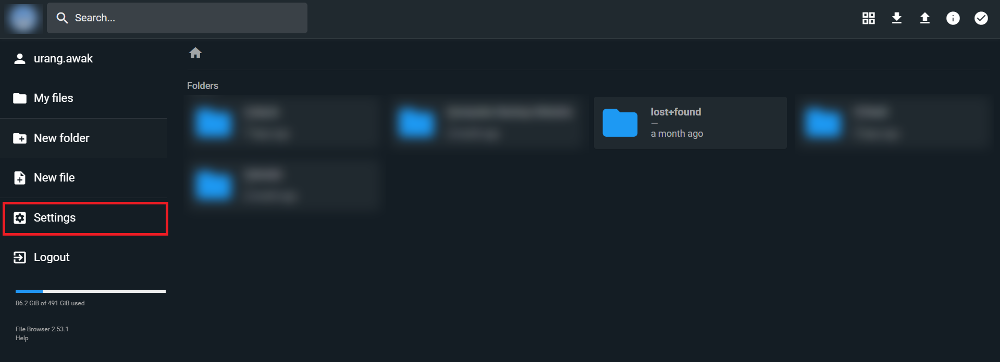
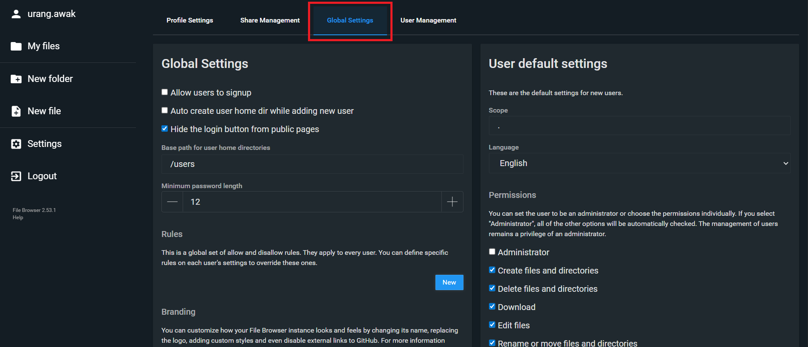
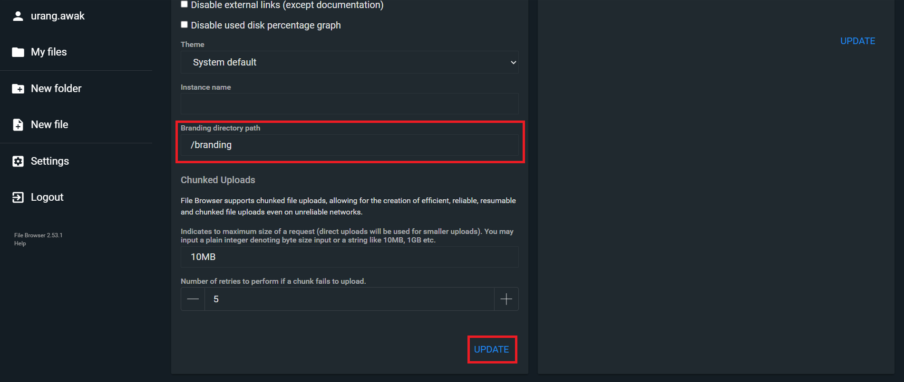
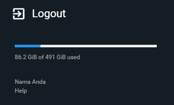

# Filebrowser Custom Sidebar Name (Docker)

Repositori ini berisi panduan dan trik CSS sederhana untuk mengubah teks *hardcoded* "File Browser" di pojok kiri bawah (sidebar) aplikasi [Filebrowser](https://github.com/filebrowser/filebrowser) menjadi nama kustom Anda sendiri. 

Solusi CSS ini sangat mudah karena **hanya** menyembunyikan teks versi bawaan, menyuntikkan nama Anda di atas tombol "Help", dan **tidak akan merusak/menghilangkan** *progress bar* kapasitas penyimpanan bawaan.

## 📌 Prasyarat
- Aplikasi Filebrowser yang berjalan menggunakan **Docker** (atau Docker Compose).
- Akses terminal/SSH ke server tempat Docker Anda berjalan.
- Akses ke akun Administrator di Web UI Filebrowser Anda.

## 🛠️ Langkah-langkah Instalasi

### 1. Buat Folder Branding
Pertama, buat sebuah folder khusus untuk menyimpan file kustomisasi (branding). Arahkan terminal Anda ke direktori tempat file `docker-compose.yml` Filebrowser Anda berada, lalu buat folder bernama `branding`:

```bash
cd /opt/filebrowser
mkdir -p branding
```

### 2. Buat File custom.css
Di dalam folder branding tersebut, buat sebuah file bernama custom.css

```bash
nano branding/custom.css
```

Salin dan tempel (paste) kode CSS berikut ke dalam file tersebut. Jangan lupa untuk mengubah "Nama Anda" menjadi nama server yang Anda inginkan:

```bash
/* 1. Sembunyikan kalimat File Browser yang merupakan 'span' pertama */
.credits > span:first-of-type {
    display: none !important;
}

/* 2. Buat nama di atas tombol Help yang merupakan 'span' terakhir */
.credits > span:last-of-type::before {
    content: "Nama Anda";
    display: block !important;
    margin-bottom: 4px !important;
    color: inherit; /* Mengikuti warna teks abu-abu bawaan */
    pointer-events: none;
}
```

### 3. Hubungkan Folder ke Docker (Volume Mapping)
Agar Filebrowser di dalam Docker bisa membaca file CSS tadi, Anda perlu menghubungkan folder branding melalui volume. Buka file docker-compose.yml Anda:
```yaml
services:
  filebrowser:
    image: filebrowser/filebrowser
    # ... konfigurasi lainnya ...
    volumes:
      - /path/ke/data/anda:/srv
      - /path/ke/database.db:/database.db
      - ./branding:/branding  # <--- TAMBAHKAN BARIS INI
```

Terapkan perubahan dengan memulai ulang kontainer Docker Anda:
```bash
docker-compose down && docker-compose up -d
```

### 4. Atur Pengaturan di Web UI Filebrowser

1. Buka Filebrowser di web browser Anda dan login sebagai Administrator.
2. Klik menu Settings.

<p align="center">

</p>

3. Pilih menu Global Settings.

<p align="center">

</p>

3. Gulir ke bawah hingga menemukan bagian Branding Directory Path.
4. Isi kolom tersebut dengan: `/branding`

<p align="center">

</p>

5. Klik tombol Update.

### 5. Terapkan Perubahan (Hard Refresh)
Langkah terakhir yang sangat penting. Peramban Anda mungkin masih menyimpan tampilan lama di dalam cache. Anda harus membersihkannya dengan melakukan Hard Refresh pada halaman Filebrowser.
- Windows / Linux: Tekan `Ctrl + F5` atau `Ctrl + Shift + R`
- Mac: Tekan `Cmd + Shift + R`

<p align="center">

</p>

Selesai! Teks "File Browser" di sidebar Anda sekarang sudah berubah menjadi nama kustom yang Anda atur. 🎉

## 📂 Struktur Folder
```plaintext
📁 filebrowser/
├── 📄 docker-compose.yml
├── 📄 filebrowser.db
├── 📄 settings.json
└── 📁 branding/
    └── 📄 custom.css
```